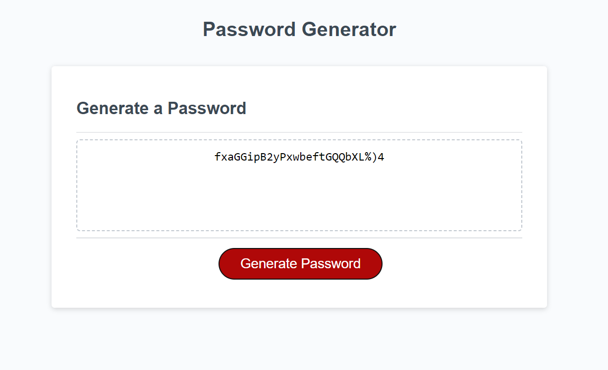
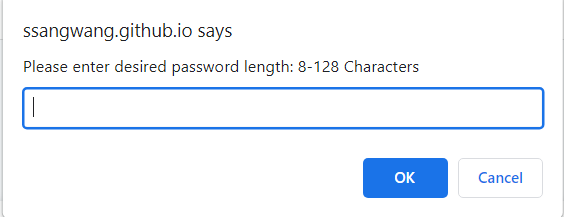
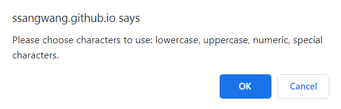
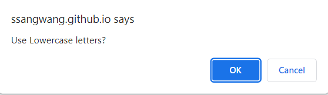
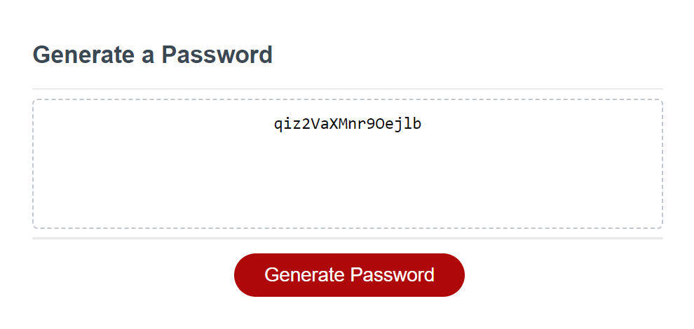

# Module-3-Challenge

## Description
This program was created for employess with access to sensitive data who want to create stronger passwords but have certain requirements (ex: Uppercase letters, numbers, special characters)

## Installation
N/A

## Usage

Visit this link to view website: https://ssangwang.github.io/Module-3-Challenge/

Click on the "Generate Password" button and follow the prompts to create a password! 

## Credits 
Nathan Darter - TA 

## License
See repository
